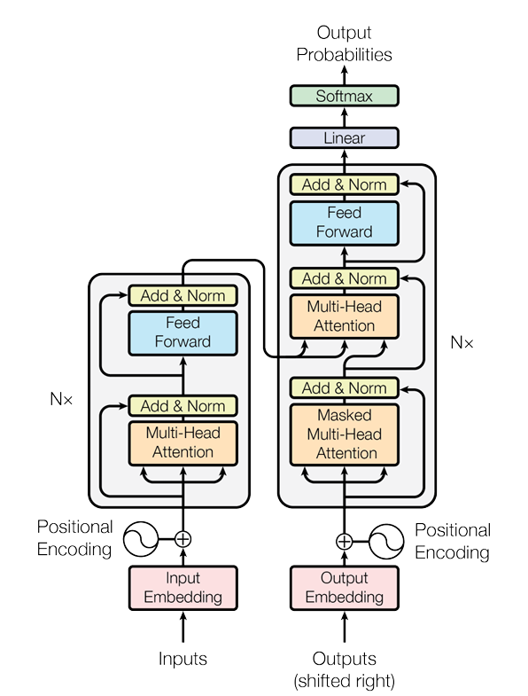
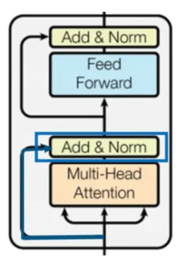

# Transformer
## overall structure

## Position Encoding 
## Multi-head Attention 
use torch.einsum to implement multi-head attention elegantly.
## Add & Norm 
Add layer means residual connection between the input and output of the multi-head attention.

Norm means Layer Normalization here.

## Feed Forward
A simple MLP structure.
## Combination